# 🧭 Tabi — Guida all'uso

Questa è una guida pratica e illustrata per usare l'app, per filo e per segno — non un
documento tecnico. Se cerchi dettagli sull'architettura o sullo stack, guarda il
[README](README.md). Versione in inglese: [GUIDA_UTENTE_EN.md](GUIDA_UTENTE_EN.md).

Gli screenshot sono presi in modalità mobile (l'app è pensata esclusivamente per
telefono) con dati di esempio, in tema chiaro per leggibilità — l'app segue sempre il
tema del tuo sistema, vedi [§13](#13-tema-chiaroscuro).

---

## Indice

1. [Primo avvio](#1-primo-avvio)
2. [Navigazione principale](#2-navigazione-principale)
3. [La Mappa](#3-la-mappa)
4. [Dettaglio di un luogo](#4-dettaglio-di-un-luogo)
5. [Creare un itinerario](#5-creare-un-itinerario)
6. [Guida gluten-free](#6-guida-gluten-free)
7. [Il menu ⚙️](#7-il-menu)
8. [Gruppo e collaborazione](#8-gruppo-e-collaborazione)
9. [Budget, biglietti e prenotazioni](#9-budget-biglietti-e-prenotazioni)
10. [Scoperta e organizzazione](#10-scoperta-e-organizzazione)
11. [Strumenti pratici](#11-strumenti-pratici)
12. [Offline e installazione come app](#12-offline-e-installazione-come-app)
13. [Tema chiaro/scuro](#13-tema-chiaroscuro)
14. [Domande frequenti](#14-domande-frequenti)

---

## 1. Primo avvio

Alla primissima apertura vedi una schermata di benvenuto con due scelte:

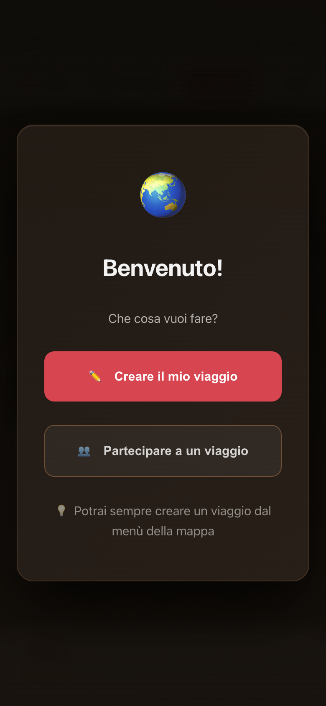

- **✏️ Creare il mio viaggio** — avvia il wizard di creazione: nome del viaggio, date,
  con chi viaggi (da solo/coppia/gruppo), interessi, eventuali vincoli alimentari
  (incluso "senza glutine" — vedi [§6](#6-guida-gluten-free)), budget giornaliero
  indicativo, destinazione (di default il Giappone, ma qualunque paese va bene: è un
  planner globale).
- **👥 Partecipare a un viaggio** — se qualcuno del tuo gruppo ha già creato il
  viaggio, entra direttamente nella sua stanza con il codice che ti ha dato, saltando
  il wizard.

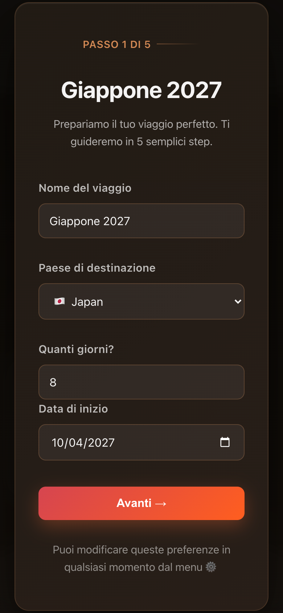

Non serve creare un account: tutto resta salvato sul tuo telefono/browser. Puoi
sempre rifare questo passaggio in seguito da **Menu → ✏️ Voglio creare il mio
viaggio**.

## 2. Navigazione principale

In basso trovi sempre 4 schede, la parte più usata dell'app:

| Icona | Nome | Cosa mostra |
|---|---|---|
| 🗺️ | **Mappa** | luoghi da visitare, filtri, meteo del giorno |
| 📅 | **Itinerario** | il tuo piano giorno per giorno |
| 💚 | **GF Guide** | ricerca gluten-free (nascondibile, [§6](#6-guida-gluten-free)) |
| ⚙️ | **Menu** | tutte le altre funzioni, elencate in [§7](#7-il-menu) |

## 3. La Mappa

La vista di apertura. Chip in alto per filtrare cosa vedi (Local, GF Places,
categoria per categoria); in basso a sinistra una card meteo del giorno corrente,
sempre visibile.

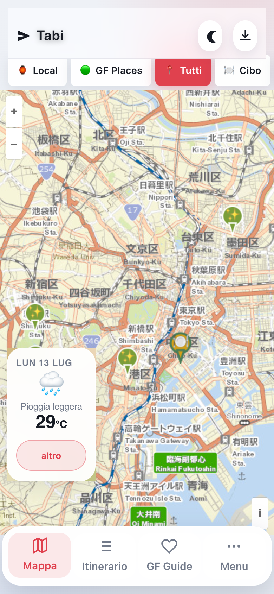

Tocca un marker per aprirne il dettaglio. I marker verdi indicano luoghi con dato
gluten-free positivo (se la guida GF è attiva).

## 4. Dettaglio di un luogo

Toccando un marker (o un risultato di ricerca) si apre la scheda completa: foto,
categoria, orari di apertura (con avviso se il luogo risulta chiuso all'orario che hai
pianificato), analisi gluten-free se pertinente, valutazione a stelle, e — se sei in
un gruppo — una sezione "Riscontri del gruppo" dove chiunque può confermare o
segnalare un problema su quel luogo.

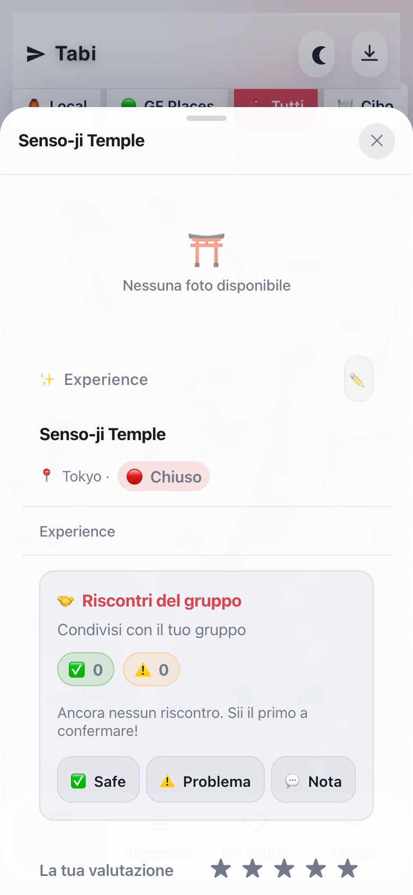

Il bottone **"➕ Aggiungi all'itinerario"** in cima alla scheda avvia il wizard
descritto nella sezione successiva.

## 5. Creare un itinerario

Dal dettaglio di un luogo, **Aggiungi all'itinerario** apre un wizard in 4 step:
giorno → orario → durata/costo/nota → riepilogo e conferma.

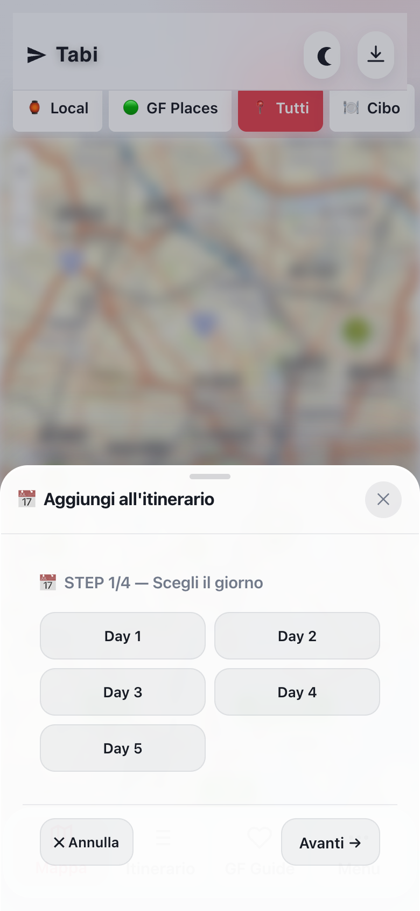

Dalla scheda **📅 Itinerario** vedi tutti i giorni del viaggio come schede
espandibili, con KPI (POI, ore di visita, costo, km) per ciascuno:

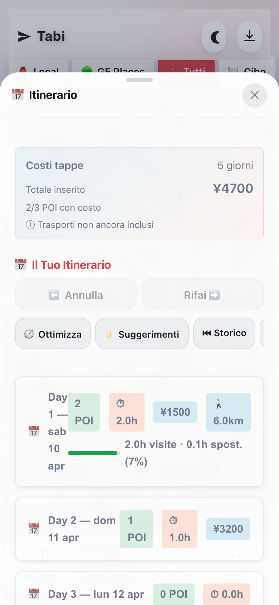

- **Trascina** una tappa per cambiarne l'ordine manualmente.
- **⬅️ Annulla / Rifai ➡️** annullano/ripetono l'ultima modifica (funziona anche con
  Ctrl+Z / Ctrl+Shift+Z da tastiera).
- **🧭 Ottimizza** (da 3+ tappe in un giorno) riordina per minimizzare gli spostamenti.
- **✨ Suggerimenti** propone posti vicini nel tempo libero che ti resta in un giorno.
- **⏮ Storico** mostra la cronologia delle modifiche, utile in un itinerario di gruppo
  per capire chi ha cambiato cosa.
- Ogni giorno mostra una barra **visite vs spostamenti**: se il carico totale supera
  le 12 ore compare un avviso "⚠️ Giornata molto densa" — non blocca nulla, è solo un
  avviso pensato per farti scoprire un problema *prima* di essere sul posto.
- In fondo trovi i bottoni di **esportazione/condivisione** (stampa, calendario .ics,
  WhatsApp, link condivisibile, condivisione col gruppo) — dettagli in
  [§8](#8-gruppo-e-collaborazione).

## 6. Guida gluten-free

Tabi è nata come guida per celiaci in viaggio in Giappone, ed è rimasta come funzione
**opzionale**, non più il centro dell'app: la trovi nell'onboarding tra i vincoli
alimentari, oppure sempre da **Menu → 🌾 Guida Gluten-Free** (toggle on/off, attivo di
default). Se non ti serve, disattivala: sparisce dalla barra di navigazione in basso e
dai filtri mappa.

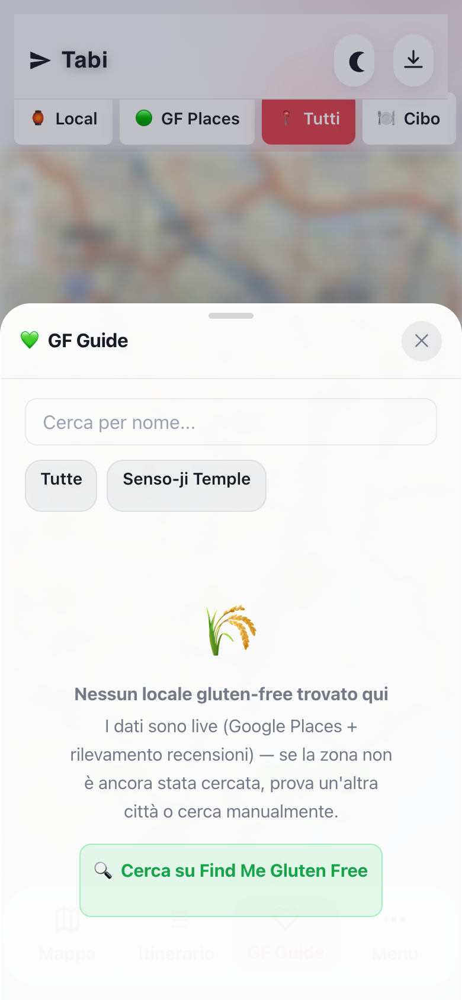

Da attiva, la scheda **💚 GF Guide** cerca ristoranti/negozi gluten-free per zona (le
"città" mostrate sono derivate dalle tappe del tuo itinerario, non una lista fissa —
è coerente con il fatto che è un planner globale) e mostra un badge di sicurezza
esplicito, sempre testo oltre al colore:

- 🟢 **SAFE** — locale verificato sicuro
- 🟡 **CAUTION** — attenzione, verifica sul posto
- 🔴 **DANGER** — locale segnalato come rischioso
- ⚪ **Sicurezza non verificata** — nessun dato ancora raccolto

## 7. Il menu ⚙️

Tocca la scheda **Menu** in basso per aprire il pannello con tutte le funzioni non
presenti nella navigazione principale, più i selettori di lingua e destinazione in
cima:

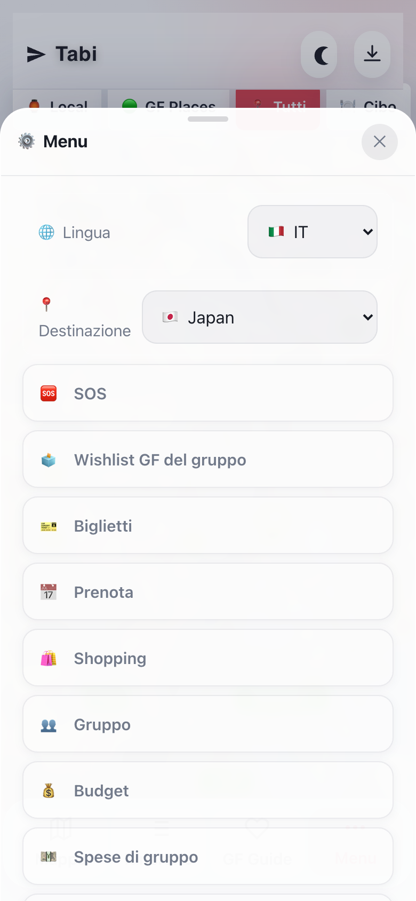

Le sezioni seguenti descrivono ogni voce, raggruppate per argomento.

## 8. Gruppo e collaborazione

Da **Menu → 👥 Gruppo**: crea una stanza (genera un codice a 8 caratteri) o entra in
una stanza esistente con il codice di un amico. Da qui vedi i membri online e il
toggle di condivisione GPS.

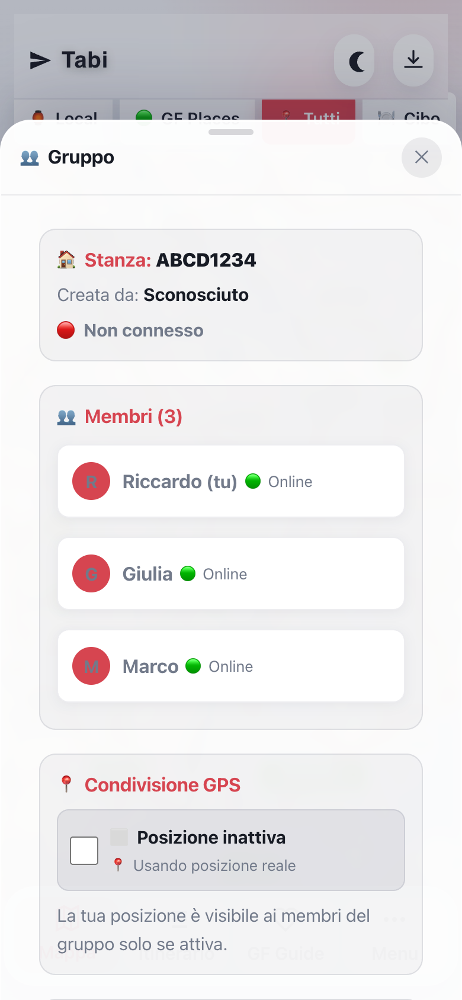

**Domande frequenti su gruppo e condivisione:**

**Posso condividere l'itinerario fuori dall'app (WhatsApp, email...)?** Sì. Dalla
vista Itinerario, il bottone di condivisione genera un **link** che contiene l'intero
itinerario codificato al suo interno — non serve un account, non serve che il
destinatario sia nel tuo gruppo. Il link viene copiato negli appunti: incollalo dove
vuoi. Chi lo apre può importare quelle tappe nel proprio itinerario con un tocco.
Limite pratico: se l'itinerario è molto lungo, il link può diventare troppo grande —
in quel caso l'app te lo segnala e puoi condividerlo con un gruppo o esportarlo come
file calendario (.ics).

**Posso condividerlo internamente, con un gruppo di cui faccio parte?** Sì. Una volta
in una stanza, puoi condividere il tuo itinerario personale con quel gruppo: da quel
momento diventa un "itinerario di gruppo" visibile a tutti i membri.

**Ogni membro può vedere e modificare l'itinerario condiviso?** Sì, entrambe le cose,
senza restrizioni di ruolo. Non c'è un concetto di "sola lettura". Se due persone
modificano nello stesso momento, l'app risolve i conflitti da sola, campo per campo:
se tu cambi l'orario di una tappa e un altro membro ne cambia la nota nello stesso
istante, vincono entrambe le modifiche. Solo se *due persone toccano lo stesso
identico campo* nello stesso momento vince la modifica più recente — e quella
scartata viene comunque registrata in un pannello di revisione conflitti. Non serve
che tutti siano online insieme: le modifiche offline si sincronizzano al ritorno.

**Vedo il GPS degli altri membri? Loro vedono il mio?** È reciproco, ma solo per chi
lo attiva (interruttore "📍 Condivisione GPS" nel pannello Gruppo, spento di default).
Ogni persona decide per sé stessa: se tu lo attivi ma un compagno no, tu sei visibile
a lui ma non vedi la sua posizione.

**Come funziona tecnicamente?** Non c'è un server proprietario: gruppo, chat, GPS ed
editing condiviso viaggiano tramite un protocollo P2P (MQTT) su un broker pubblico
gratuito. Zero account, zero costi — ma se quel broker ha un disservizio, la sync di
gruppo si ferma temporaneamente (l'itinerario personale resta sul tuo telefono).

### Chat di gruppo

Dentro il pannello Gruppo, il bottone chat apre una chat in tempo reale con tutti i
membri della stanza:

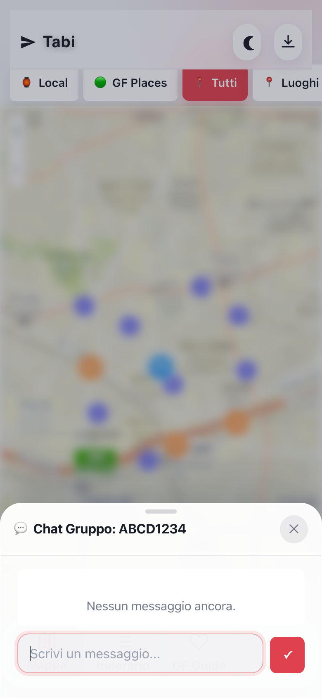

### Spese di gruppo

Da **Menu → 💴 Spese di gruppo**: registra una spesa comune, l'app calcola i saldi tra
i membri (chi deve dare/avere a chi).

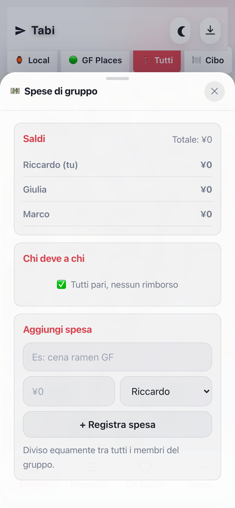

### Checklist del gruppo

Da **Menu → 📋 Checklist del gruppo**: una lista condivisa di cose da fare/portare
prima della partenza (JR Pass, adattatori, eSIM...), spuntabile da chiunque nel
gruppo.

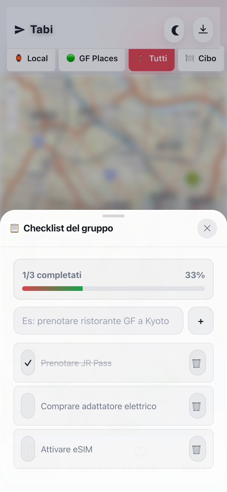

### Wishlist GF del gruppo

Da **Menu → 🗳️ Wishlist GF del gruppo**: proponi un locale gluten-free al gruppo, gli
altri membri possono votarlo. Se non sei ancora in un gruppo, l'app te lo dice
onestamente (salvataggio solo locale) invece di fingere una condivisione che non
avviene.

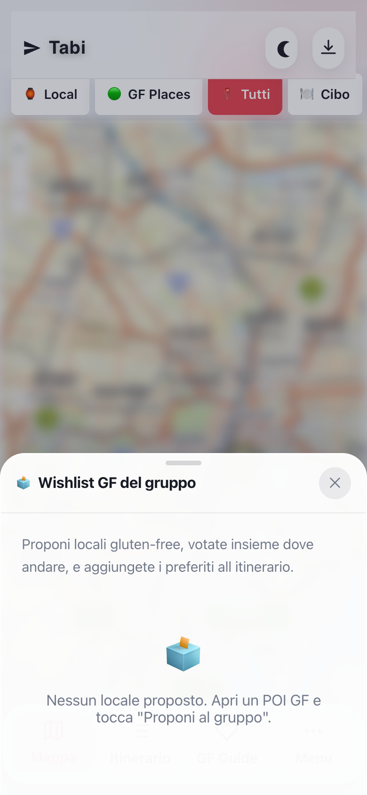

## 9. Budget, biglietti e prenotazioni

### Budget

Da **Menu → 💰 Budget**: imposta un budget totale, scegli la valuta con cui vedere gli
importi (conversione automatica dal tasso di cambio aggiornato), registra le spese man
mano che le fai.

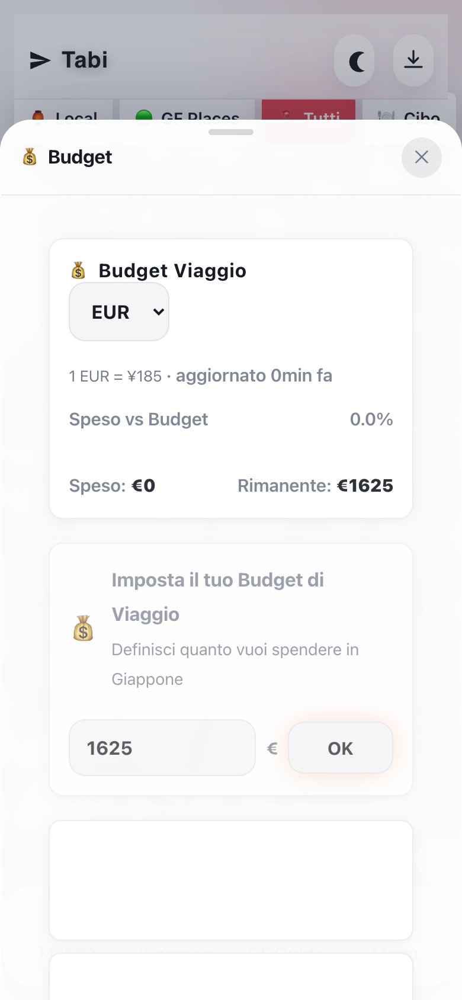

Ogni spesa conserva anche **valuta e importo originali con cui l'hai inserita**, così
se cambi la valuta di visualizzazione non perdi la traccia di quanto avevi pagato
davvero. La schermata mostra: totale speso vs budget, ripartizione per categoria
(cibo, trasporti, alloggio, shopping, attività, altro), giorni pianificati (giorni con
almeno una tappa in itinerario) e le ultime spese registrate.

### Biglietti

Da **Menu → 🎫 Biglietti**: salva biglietti/prenotazioni già acquistati con tipo
(trasporto, ingresso, alloggio, evento), titolo, fornitore, codice/PNR, data e ora,
prezzo, note, e uno stato aggiornabile (prenotato → pagato → usato, o scaduto/annullato).

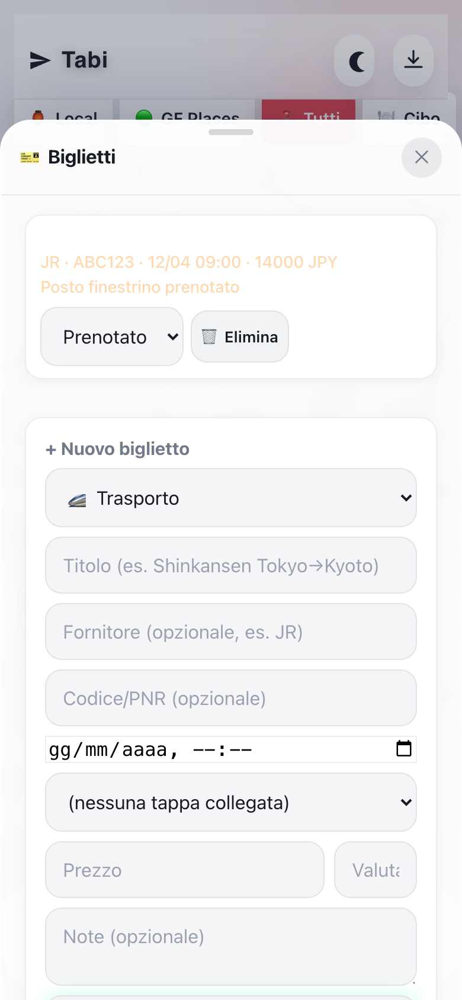

È separato da **📅 Prenota**, che invece resta il posto dove trovi i link diretti di
prenotazione (TableCheck, Tabelog, sito, telefono) per i ristoranti/POI che li hanno —
due cose diverse: link esterni pronti all'uso vs. i tuoi biglietti già acquistati.

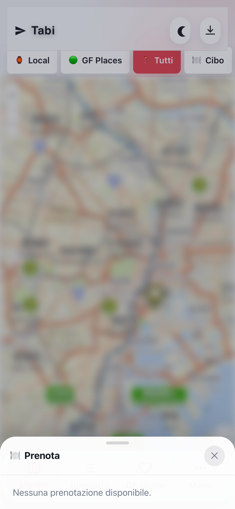

### Shopping

Da **Menu → 🛍️ Shopping**: elenco di negozi (normali e vintage/second-hand) vicino
alle tue tappe, con link diretto a Google Maps (e Apple Maps su iPhone).

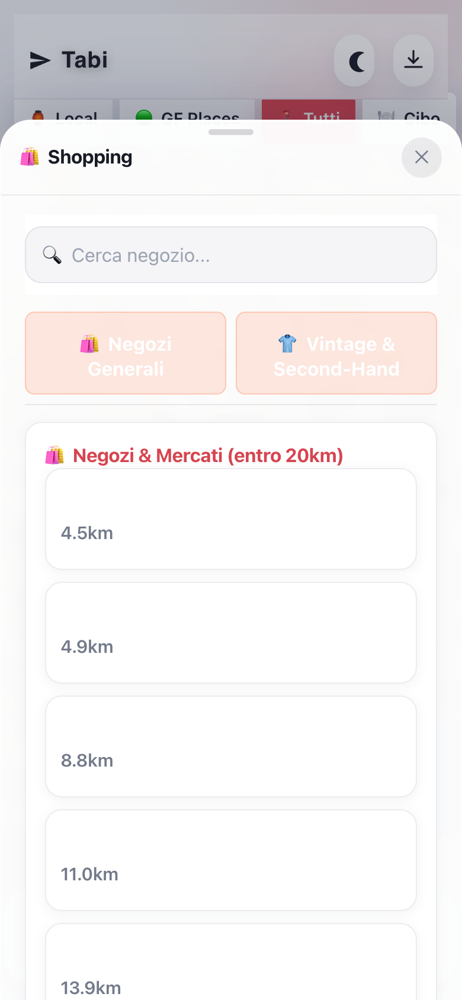

## 10. Scoperta e organizzazione

### Timeline viaggio

Da **Menu → 🗓️ Timeline viaggio**: tutti i giorni in ordine cronologico, con badge
"OGGI" sul giorno corrente e countdown alla prossima tappa — pensata per essere
consultata rapidamente mentre sei in giro.

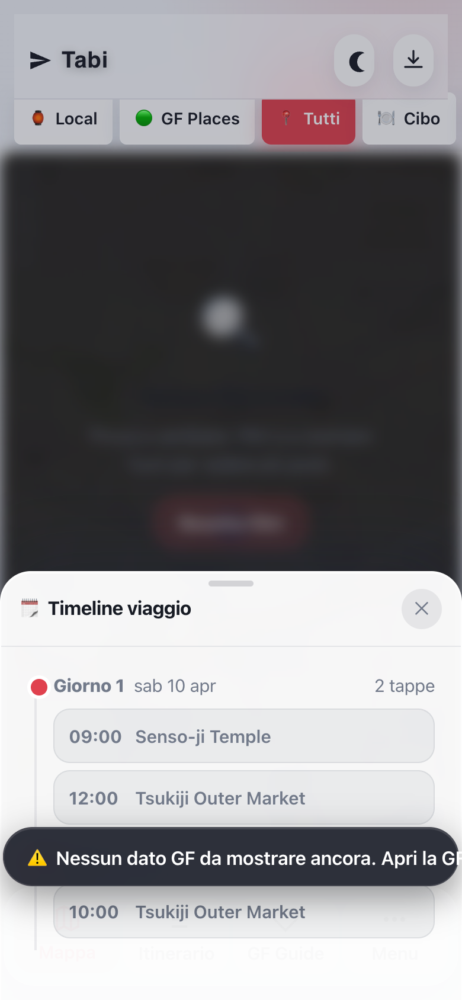

### Suggerimenti tempo libero

Da **Menu → ✨ Suggerimenti tempo libero**: analizza i buchi liberi nel tuo
itinerario e propone POI vicini per riempirli.

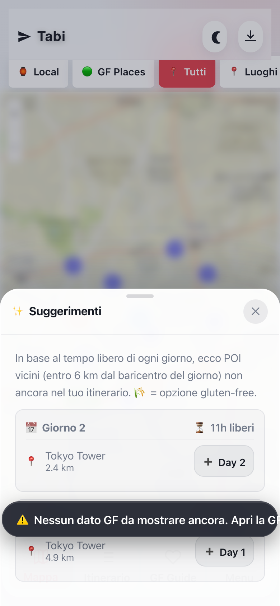

### Cerca ovunque

Da **Menu → 🔍 Cerca ovunque**: un unico campo di ricerca su tutti i luoghi
disponibili, per saltare direttamente al dettaglio senza scorrere la mappa.

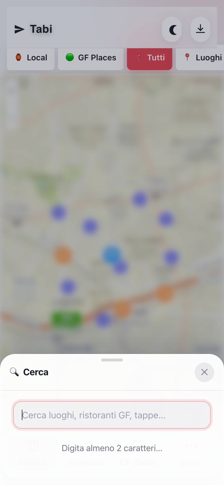

### Heatmap GF

Da **Menu → 🔥 Heatmap GF**: visualizza sulla mappa dove si concentrano i locali
gluten-free segnalati, utile per scegliere in che zona muoverti.

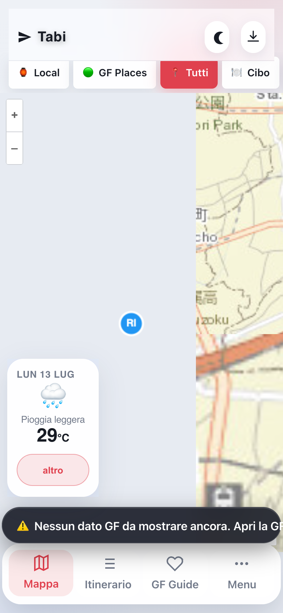

### Suggerisci Posti

Da **Menu → 💡 Suggerisci Posti**: proponi un nuovo locale gluten-free non ancora
nel database, con analisi automatica se hai una foto del menu.

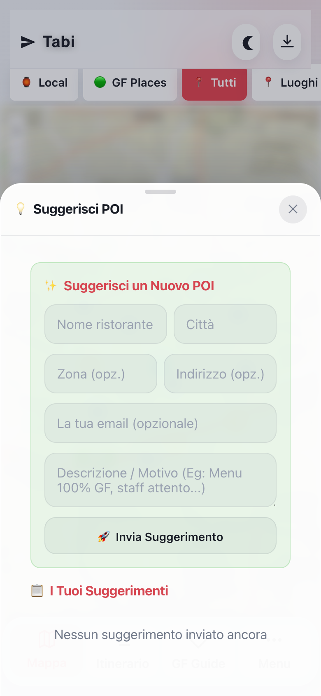

### Galleria

Da **Menu → 📸 Galleria**: le foto del viaggio salvate sul dispositivo (non caricate
altrove), organizzabili con didascalie. Tocca una foto per ingrandirla.

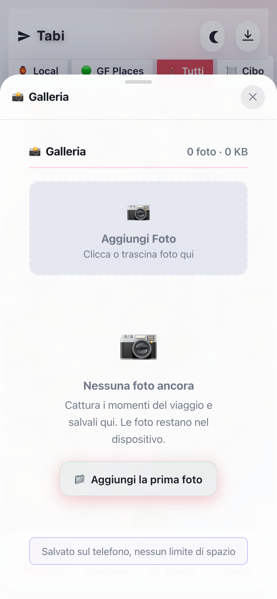

### Tips Viaggio

Da **Menu → 🌸 Tips Viaggio**: consigli pratici generali sul viaggio.

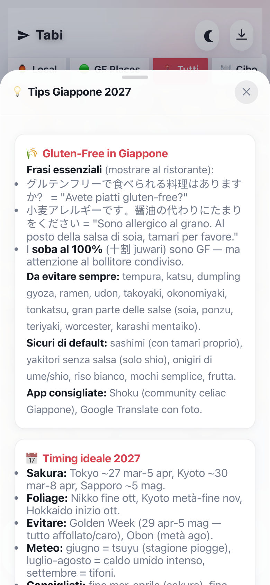

## 11. Strumenti pratici

### 🆘 SOS

Da **Menu → 🆘 SOS** (in cima al menu, non a caso: è pensata per essere trovata in
fretta in un'emergenza): numero di emergenza locale con copia rapida, frase di
emergenza pre-tradotta da mostrare a un cameriere o medico ("sono celiaco, non posso
mangiare pane/frumento"), carta allergie multilingua scaricabile, e indirizzo/telefono
dell'ospedale principale della zona.

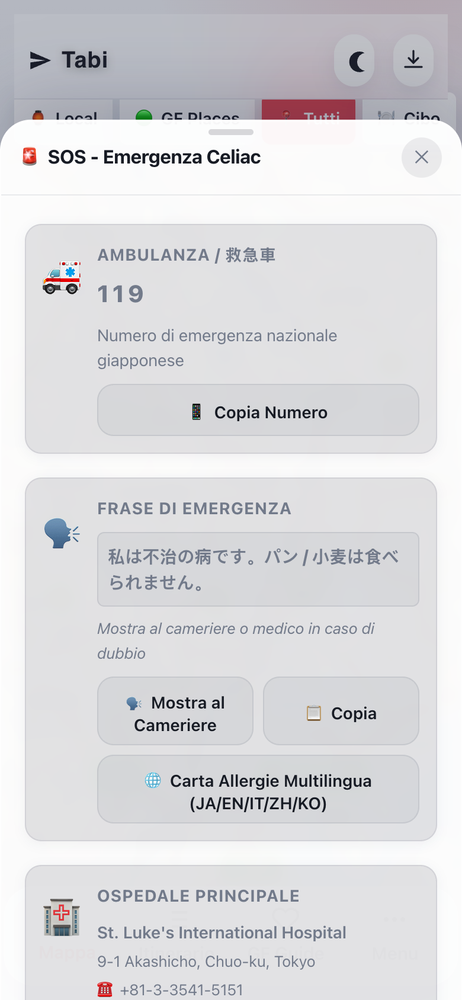

### Conviene il JR Pass?

Da **Menu → 🚄 Conviene il JR Pass?** (solo per viaggi in Giappone): calcola, in base
alle tratte già nel tuo itinerario, se conviene comprare il Japan Rail Pass o singoli
biglietti — con stima del risparmio/costo extra per ciascuna durata di pass.

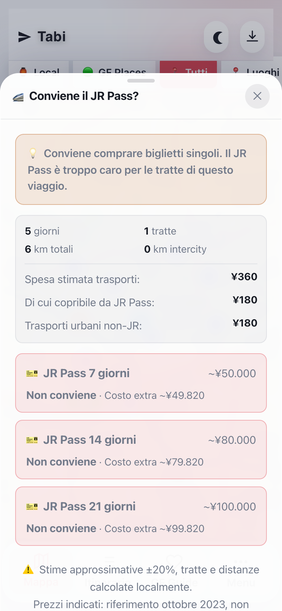

### Calendario Giappone

Da **Menu → 📅 Calendario Giappone** (solo per viaggi in Giappone): festività e
giorni particolari che cadono nelle date del tuo viaggio (es. Golden Week), utile per
anticipare folla e chiusure.

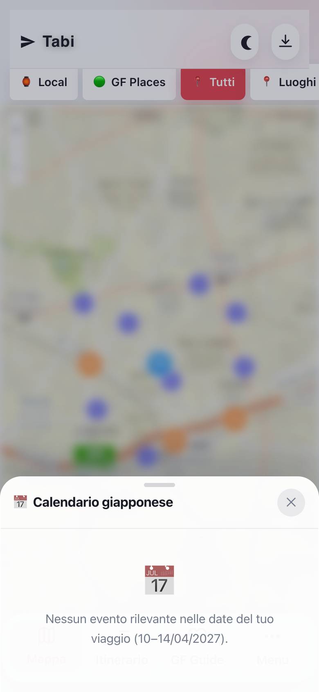

### Assistente AI

Da **Menu → 🤖 Assistente AI**: analisi assistita da AI di un menu o di una domanda
sul gluten-free, quando la ricerca automatica non basta.

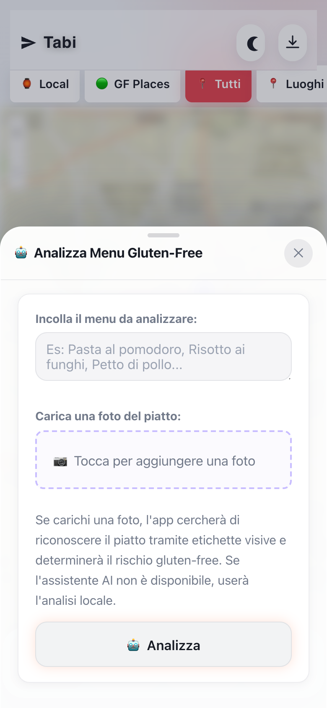

### Promemoria Tappe

Da **Menu → 🔔 Promemoria Tappe**: attiva notifiche che ti avvisano un po' prima
dell'orario di ogni tappa pianificata.

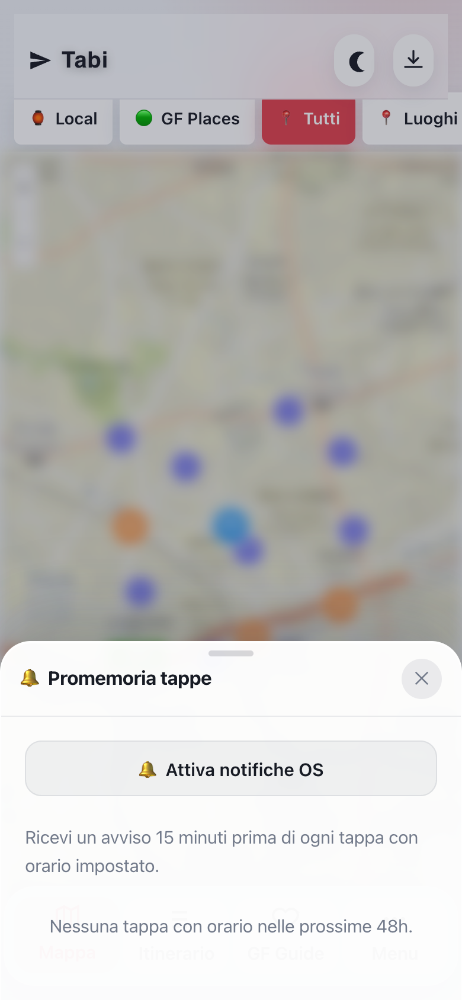

### Backup & Ripristino

Da **Menu → 📦 Backup & Ripristino**: esporta tutti i tuoi dati (itinerario, budget,
biglietti, checklist, spese) in un file — essenziale se cambi telefono.

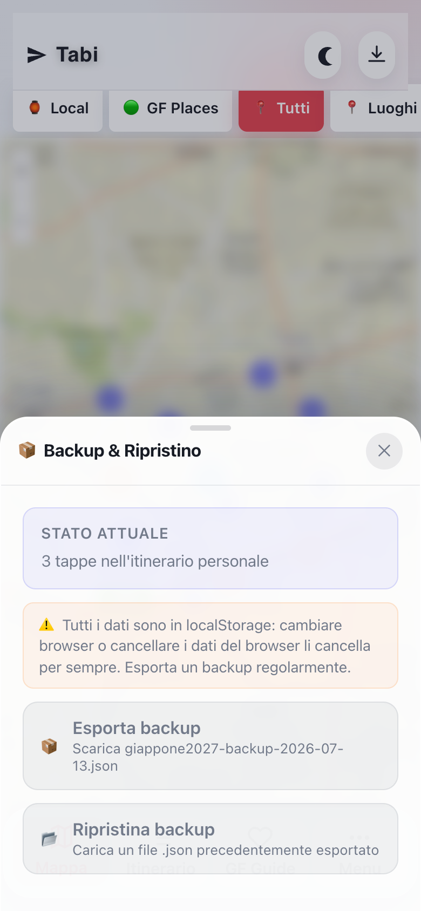

### Scarica per offline

Da **Menu → 📥 Scarica per offline**: scarica in anticipo le tile della mappa di una
zona, per poterle consultare senza connessione.

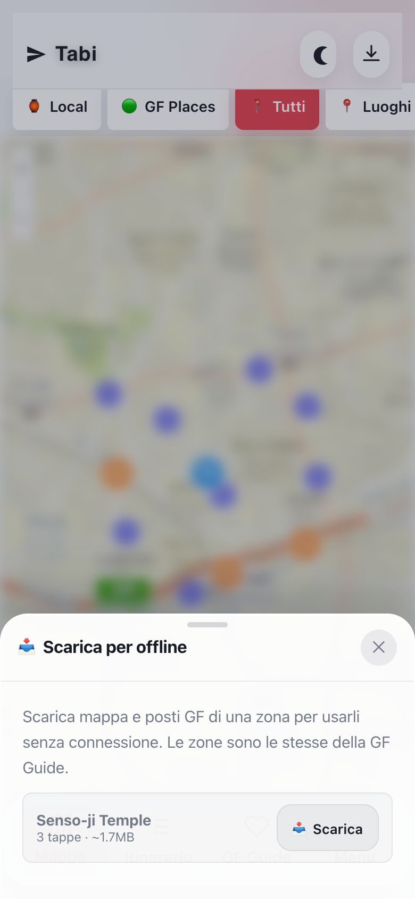

### Risparmio batteria

Da **Menu → 🔋 Risparmio batteria**: un interruttore che disattiva animazioni ed
effetti visivi pesanti per consumare meno batteria durante il viaggio — utile in
giornate lunghe fuori casa.

## 12. Offline e installazione come app

Tabi è una PWA: puoi installarla sulla schermata Home (Safari su iPhone: Condividi →
"Aggiungi a Home"; Chrome su Android: menu → "Installa app"). Una volta installata,
funziona anche **offline** per tutto ciò che hai già pianificato (itinerario, budget,
biglietti salvati) — utile in aereo o in zone senza copertura. Ricerca nuovi luoghi,
foto e analisi gluten-free richiedono connessione (dipendono da servizi esterni).

## 13. Tema chiaro/scuro

L'app **non ha un interruttore tema al suo interno**: segue sempre l'impostazione del
tuo telefono/browser (chiaro o scuro). Se vuoi cambiarlo, lo fai dalle impostazioni di
sistema, non dentro Tabi.

## 14. Domande frequenti

**Devo creare un account?** No, mai. Tutto resta sul tuo dispositivo.

**Cosa succede se cambio telefono?** Da **Menu → 📦 Backup & Ripristino** esporti
tutti i tuoi dati in un file, che poi importi sul nuovo dispositivo.

**I tempi di spostamento sono affidabili?** Sono stime (basate su distanza in linea
d'aria e velocità media del mezzo scelto, o su Google Maps quando disponibile) — utili
per capire se una giornata sta in piedi, non un orario ufficiale dei mezzi pubblici.

**L'app costa qualcosa?** L'app in sé è gratuita. Alcune funzioni (ricerca luoghi,
foto, analisi AI del gluten-free) dipendono da servizi esterni a pagamento gestiti dal
gestore dell'app — se la quota finisce, quelle funzioni degradano a stime locali
invece di sparire del tutto.

**Perché una voce del menu "Errori (debug)" non compare mai?** È una funzione di
sviluppo, visibile solo con `window.DEBUG` attivo — non pensata per l'uso normale.
