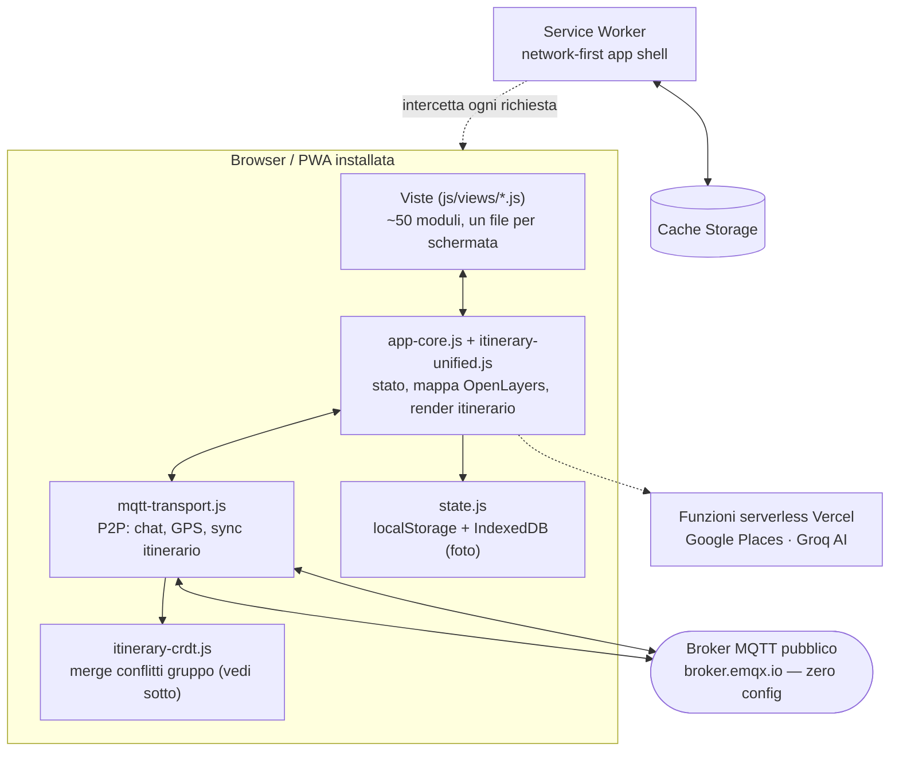
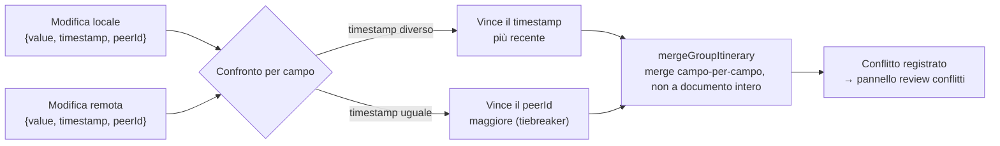
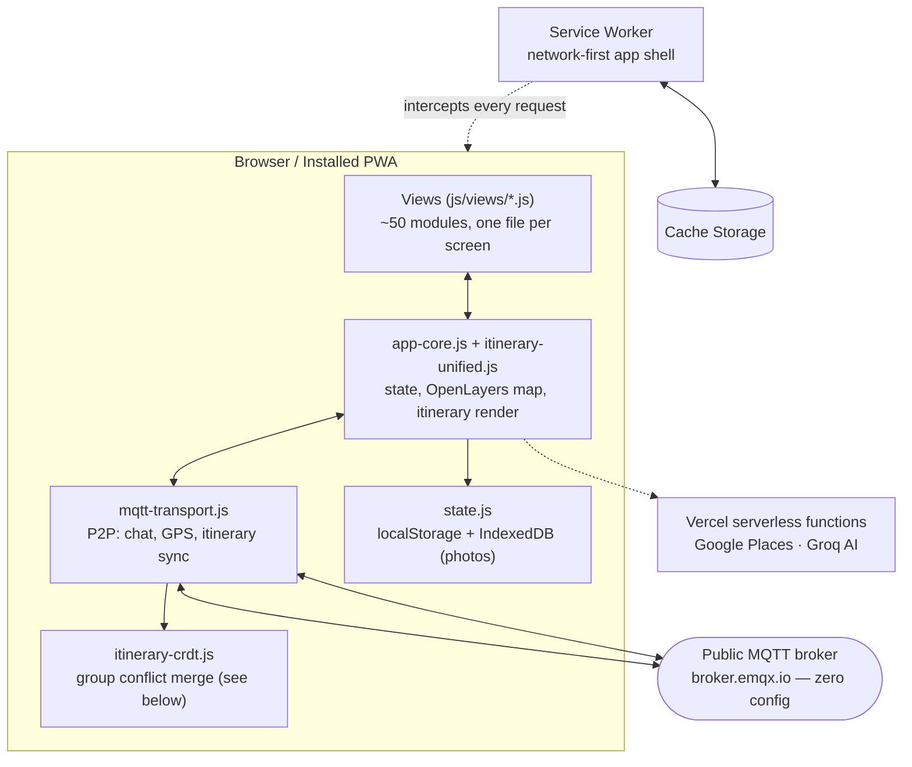
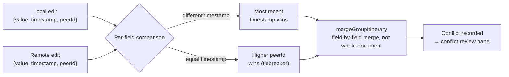

<div align="center">

# 🧭 Tabi (旅)

**PWA di pianificazione viaggi — itinerari globali con tempi/costi calcolati, collaborazione P2P in tempo reale, tema automatico da sistema.**

[](#installazione--installation)
[](#architettura--architecture)
[](#stack-tecnico--tech-stack)
[](#collaborazione-p2p--come-funziona-davvero)
[](https://vercel.com)

[Italiano](#italiano) · [English](#english) · [📖 Guida all'uso](GUIDA_UTENTE.md)

</div>

---

# Italiano

## Cosa fa

Tabi è un planner di itinerari di viaggio, non una guida generica: la differenza è che
tratta **tempo e denaro come quantità calcolate**, non come note a margine. Nato come
app verticale per celiaci in viaggio in Giappone (SafeEats), è stato globalizzato in un
planner per qualsiasi destinazione, mantenendo il layer gluten-free come funzione
opzionale invece che come cuore del prodotto.

- **Itinerario giorno-per-giorno** — tappe con orari e durate, tempo/distanza calcolati
  tra tappe consecutive (Google Distance Matrix con fallback haversine), riordino,
  ottimizzatore per minimizzare gli spostamenti.
- **KPI visite vs spostamenti + warning densità** — ogni giornata mostra quanto tempo
  va in visite e quanto in trasferimenti, e segnala quando il carico supera una soglia
  realistica (12h), prima che tu scopra sul posto che il piano non regge.
- **Budget multi-valuta** — preventivo per categoria vs speso reale, cambio live,
  valuta di casa dedotta dal locale del browser invece che fissata al Giappone.
- **Collaborazione di gruppo in tempo reale** — chat, GPS condiviso, editing itinerario
  condiviso con merge automatico dei conflitti, senza alcun backend proprietario (vedi
  sotto per come funziona davvero).
- **Guida gluten-free opzionale** — ricerca ristoranti/negozi per città, analisi
  sicurezza (GREEN/YELLOW/RED), attivabile/disattivabile da un toggle: non è più il
  cuore dell'app, ma resta disponibile per chi ne ha bisogno.
- **Tema chiaro/scuro automatico** — segue sempre `prefers-color-scheme` del sistema,
  nessun toggle manuale in-app: la scelta è del telefono, non dell'app.
- **PWA offline-capable** — installabile su home screen, service worker con strategia
  network-first per l'app shell (niente "ho aggiornato ma vedo ancora la versione
  vecchia"), funziona anche senza connessione per la pianificazione già fatta.
- **i18n** — italiano, inglese, giapponese.

## Architettura

Nessun framework, nessuna build step, nessun bundler: JavaScript vanilla caricato
direttamente dal browser (~90 tag `<script defer>`), moduli pesanti o di feature
secondarie lazy-loaded on-demand. Non è nostalgia — è la stessa filosofia di
"zero dipendenze, codice leggibile, peso di pagina minimo" adottata di proposito.



## Collaborazione P2P — come funziona davvero

Voglio essere preciso: non c'è un backend proprietario dietro la collaborazione di
gruppo. Il transport è **MQTT su WebSocket** verso un broker pubblico
(`broker.emqx.io`, zero signup, zero limite messaggi) — ogni membro del gruppo
pubblica e sottoscrive lo stesso topic. Non c'è nessun server che possiede lo stato:
lo stato vive nei client, e quando due persone modificano l'itinerario nello stesso
momento (offline entrambe, o semplicemente in parallelo), serve un modo deterministico
per risolvere il conflitto senza un arbitro centrale.



Il merge (`itinerary-crdt.js:18` e `:41`) è **last-write-wins a livello di singolo
campo**, non di documento intero — se io modifico l'orario di una tappa e tu ne
modifichi la nota nello stesso istante, vincono entrambe le modifiche, non una a
scapito dell'altra. Solo quando lo *stesso campo* viene toccato da due parti si
applica il confronto timestamp→peerId. Ogni conflitto risolto viene registrato e
mostrato in un pannello di review (`conflict-resolver-ui.js`), così l'utente sa
sempre quando una sua modifica è stata sovrascritta da un pari, invece di scoprirlo
per caso.

## Processo di sviluppo assistito da Claude

**La maggior parte del codice di questo repository è stata scritta con Claude
(Anthropic), su più sessioni.** Il mio contributo umano: direzione di prodotto (cosa
costruire, in che ordine, quali compromessi), decisioni di design non delegabili
(es. "il tema deve seguire il sistema, non un toggle"), e revisione diretta di ogni
modifica prima che venga pubblicata — inclusi gli screenshot che hanno guidato buona
parte del redesign visivo.

Per i lavori di refactor/redesign più estesi, il processo seguito è stato:

1. **Scoping in cluster di file non sovrapposti** prima di qualunque modifica, per
   poter dispatchare **agenti Claude in parallelo** senza rischio di collisione — ogni
   agente lavora solo sui propri file assegnati, mai su CSS condiviso o file di un
   altro agente.
2. **Verifica obbligatoria per ogni agente**: `node --check` su ogni file modificato
   prima di dichiararsi concluso, più un riepilogo conciso e verificabile di cosa è
   stato cambiato file per file.
3. **Verifica consolidata mia, dopo ogni gruppo di agenti**: `node --check` su tutti i
   file toccati, uno smoke-test headless (avvia l'app, verifica assenza di eccezioni
   JS di boot), e un giro visivo in browser reale su un campione di schermate prima di
   ogni commit. Nessuna modifica arriva su `main` senza questi tre passaggi.

Alcuni problemi concreti trovati così, non ipotetici:

- **Un bug di contrasto di sistema**: il flip da tema scuro a chiaro dei pannelli ha
  richiesto ri-mappare centinaia di regole CSS che leggevano gli stessi design token;
  al primo giro, i token testo erano stati invertiti nella direzione sbagliata e il
  titolo "Budget Viaggio" risultava chiaro-su-chiaro, quasi invisibile — non un errore
  di sintassi, un bug di **direzione logica** in un flip di token a livello di sistema,
  trovato solo ispezionando visivamente lo screenshot renderizzato, non leggendo il CSS.
- **Un bug di specificità CSS**: una voce del menu restava sempre grigio-translucida
  nonostante una regola `!important` dedicata — causa reale: un'altra regola generica
  per i bottoni dei pannelli aveva specificità CSS più alta (tre classi effettive
  contro due), e vinceva silenziosamente. Risolto escludendo esplicitamente quella
  classe dalla regola generica, non alzando all'infinito la specificità della regola
  specifica.
- **Una trappola di cache del server di sviluppo**: durante la verifica visiva, CSS e
  JS modificati apparivano "non applicati" nel browser di test nonostante il server
  servisse correttamente i file nuovi — causa: cache HTTP del browser sulle risorse
  referenziate da `<link>`/`<script>`, non sul documento HTML. Diagnosticato
  confrontando `fetch(url, {cache:'no-store'})` (sempre aggiornato) con lo stato
  effettivamente renderizzato (stantio), poi risolto forzando il refresh della
  risorsa specifica.

## Cosa NON fa (onestà prima di tutto)

- **Non è gratis al 100%.** Ricerca POI (Google Places), Distance Matrix per i tempi
  reali, e l'analisi AI del gluten-free (Groq) sono servizi a pagamento con quota
  gestita lato server — degradano a stime locali (haversine) quando la quota finisce,
  non si rompono, ma non sono infrastruttura gratuita.
- **Nessun backend proprietario.** La collaborazione di gruppo vive su un broker MQTT
  pubblico di terze parti: se `broker.emqx.io` ha un downtime, la sync di gruppo si
  ferma (un fallback verso altri broker è previsto ma non garantito).
- **Nessun test automatico.** A differenza di progetti con suite `node --test`, la
  verifica di correttezza qui è: `node --check` (sintassi), smoke-test headless
  (assenza di eccezioni al boot), e ispezione visiva umana — non asserzioni
  automatiche sul comportamento.
- **I tempi di spostamento sono stime, non orari reali dei mezzi pubblici.** Non esiste
  un'API di routing transit realtime gratuita a livello globale; dove la quota Google
  è disponibile i tempi sono più precisi (Distance Matrix), altrimenti sono stime
  haversine × velocità media per il mezzo scelto.
- **Local-first, non multi-device sync automatico.** Lo stato personale vive in
  localStorage/IndexedDB del singolo browser; passare a un altro dispositivo richiede
  l'export/import di backup JSON.

## Roadmap / cosa manca

Validata con agenti di ricerca dedicati prima di scrivere codice (non solo dichiarata):
ogni item sotto è stato verificato contro il codice reale, non assunto.

- [x] ~~Vault biglietti~~ — fatto: entità ticket con stati (prenotato/pagato/usato/
  scaduto/annullato), voce menu dedicata. Manca ancora: collegare un ticket a una
  tappa/giorno specifici da un picker in UI (i campi esistono nello schema, nessuna
  UI li popola) e filtri/ricerca sul vault.
- [x] ~~Cambio congelato per spesa~~ — fatto: ogni spesa salva anche valuta/importo
  originali dell'inserimento.
- [x] ~~Opzione gluten-free nell'onboarding~~ — fatto: il form la raccoglieva già,
  ora è collegata al toggle reale.
- [x] ~~Plugin destinazione gated~~ — fatto: JR Pass/calendario festività si
  nascondono se il viaggio non è in Giappone (dedotto dalle tappe/vista mappa, non
  da un campo destinazione esplicito — l'app non ne ha uno).
- [x] ~~Vista "Oggi" da campo~~ — fatto: la timeline evidenzia il giorno corrente e
  mostra il countdown alla prossima tappa.
- [ ] **Consolidamento moduli itinerario** (~16 file) — un'analisi dedicata ha
  smentito la stima iniziale di "basso rischio": l'accoppiamento reale tra i moduli
  (chiamate `window.*` incrociate, UI layer non isolabile) rende il refactor
  moderato-alto rischio. Serve un'analisi approfondita prima di qualunque fusione,
  non un pass rapido — rimandato di proposito.
- [ ] **Migrazione ricerca → Nominatim/Overpass** per un free-tier 100% — verificato
  e **sconsigliato**: comporterebbe perdere foto dei luoghi e orari di apertura
  affidabili, entrambi usati quotidianamente. Da riconsiderare solo se la quota
  Google diventa un blocco reale, non per principio.

## Stack tecnico

| | |
|---|---|
| Frontend | JavaScript vanilla, nessun framework, nessuna build step |
| Mappa | OpenLayers 8 + tile ArcGIS |
| Ricerca POI | Google Places (serverless Vercel) + Nominatim/OSM come fallback |
| Collaborazione | MQTT su WebSocket (P2P, broker pubblico) |
| Persistenza | localStorage (stato) + IndexedDB (foto) |
| Offline | Service Worker, strategia network-first per l'app shell |
| Stile | CSS custom properties, tema chiaro/scuro da `prefers-color-scheme`, liquid glass |
| AI | Groq (serverless), analisi gluten-free su menu/foto |
| Deploy | Vercel, statico + funzioni serverless, auto-deploy su push |
| Dipendenze runtime | zero (nessun `node_modules` servito al client) |

## Installazione / Installazione locale

```bash
git clone https://github.com/Moriconz/Giappone-2027.git
cd Giappone-2027
python3 -m http.server 8080
# apri http://localhost:8080
```

> Le funzioni `api/` (Google Places, Groq) sono serverless Vercel: con un server
> statico locale non girano, quindi ricerca POI e analisi GF degradano. Itinerario,
> budget, mappa, collaborazione e offline funzionano comunque.

Per installarla come PWA: apri l'URL da Chrome (Android) o Safari (iOS) e usa
"Aggiungi alla schermata Home" — funziona offline dal primo avvio.

```bash
npm run smoke        # smoke test e2e (richiede il server sopra attivo)
npm run lint:i18n    # verifica coerenza chiavi di traduzione
```

---

# English

## What it does

Tabi is a travel itinerary planner, not a generic travel guide: the difference is that
it treats **time and money as calculated quantities**, not sidebar notes. It started
as a vertical app for celiac travelers in Japan (SafeEats) and was globalized into a
planner for any destination, keeping the gluten-free layer as an optional feature
instead of the product's core.

- **Day-by-day itinerary** — stops with times and durations, travel time/distance
  computed between consecutive stops (Google Distance Matrix with a haversine
  fallback), reordering, a route optimizer to minimize travel.
- **Visit-vs-travel KPI + density warning** — every day shows how much time goes to
  visits versus transfers, and flags when the load crosses a realistic threshold
  (12h) — before you find out on the ground that the plan doesn't hold.
- **Multi-currency budget** — category budget vs actual spend, live FX rates, home
  currency inferred from the browser locale instead of being pinned to Japan.
- **Real-time group collaboration** — chat, shared GPS, shared itinerary editing with
  automatic conflict merging, with no proprietary backend (see below for how it
  actually works).
- **Optional gluten-free guide** — restaurant/shop search by city, safety analysis
  (GREEN/YELLOW/RED), toggle on/off: no longer the app's core, but still there for
  anyone who needs it.
- **Automatic light/dark theme** — always follows the system's `prefers-color-scheme`,
  no manual in-app toggle: the choice belongs to the phone, not the app.
- **Offline-capable PWA** — installable on the home screen, service worker with a
  network-first strategy for the app shell (no "I updated but still see the old
  version"), works offline for anything already planned.
- **i18n** — Italian, English, Japanese.

## Architecture

No framework, no build step, no bundler: vanilla JavaScript loaded directly by the
browser (~90 `<script defer>` tags), with heavier or secondary-feature modules
lazy-loaded on demand. Not nostalgia — the same "zero dependencies, readable code,
minimal page weight" philosophy, applied deliberately.



## P2P collaboration — how it actually works

I want to be precise here: there is no proprietary backend behind group
collaboration. The transport is **MQTT over WebSocket** to a public broker
(`broker.emqx.io`, zero signup, no message limit) — every group member publishes and
subscribes to the same topic. No server owns the state: state lives in the clients,
and when two people edit the itinerary at the same moment (both offline, or simply in
parallel), you need a deterministic way to resolve the conflict without a central
arbiter.



The merge (`itinerary-crdt.js:18` and `:41`) is **last-write-wins at the individual
field level**, not the whole document — if I change a stop's time and you change its
note at the same instant, both changes win, neither is discarded. Only when the
*same field* is touched by both sides does the timestamp→peerId comparison kick in.
Every resolved conflict is recorded and surfaced in a review panel
(`conflict-resolver-ui.js`), so the user always knows when their edit was overwritten
by a peer, instead of finding out by accident.

## Claude-assisted development process

**Most of the code in this repository was written with Claude (Anthropic), across
multiple sessions.** My human contribution: product direction (what to build, in what
order, which trade-offs), non-delegable design calls (e.g. "the theme must follow the
system, not a toggle"), and direct review of every change before it shipped — including
the screenshots that drove much of the visual redesign.

For the larger refactor/redesign work, the process followed was:

1. **Scoping into non-overlapping file clusters** before any change, so that
   **parallel Claude agents** could be dispatched with no collision risk — each agent
   works only on its assigned files, never on shared CSS or another agent's files.
2. **Mandatory per-agent verification**: `node --check` on every modified file before
   declaring done, plus a concise, checkable file-by-file summary of what changed.
3. **My own consolidated verification after every batch of agents**: `node --check`
   across all touched files, a headless smoke test (boots the app, checks for JS boot
   exceptions), and a real-browser visual pass over a sample of screens before every
   commit. Nothing reaches `main` without these three gates.

A few concrete problems found this way, not hypothetical ones:

- **A systemic contrast bug**: flipping panels from dark to light theme required
  remapping hundreds of CSS rules reading the same design tokens; on the first pass,
  the text tokens were flipped in the wrong direction and the "Budget Viaggio" title
  rendered light-on-light, nearly invisible — not a syntax error, a **logical-direction
  bug** in a system-wide token flip, only caught by visually inspecting the rendered
  screenshot, not by reading the CSS.
- **A CSS specificity bug**: one menu item stayed grey-translucent despite a dedicated
  `!important` rule — the real cause: another generic panel-button rule had higher CSS
  specificity (three effective classes versus two) and silently won. Fixed by
  explicitly excluding that class from the generic rule, not by endlessly raising the
  specificity of the specific one.
- **A dev-server caching trap**: during visual verification, edited CSS/JS appeared
  "not applied" in the test browser even though the server was correctly serving the
  new files — cause: browser HTTP caching on the resources referenced by
  `<link>`/`<script>`, not on the HTML document itself. Diagnosed by comparing
  `fetch(url, {cache:'no-store'})` (always fresh) against what was actually rendered
  (stale), then fixed by force-refreshing the specific resource.

## What it does NOT do (honesty first)

- **Not 100% free.** POI search (Google Places), real Distance Matrix travel times, and
  the gluten-free AI analysis (Groq) are paid services with server-side quota
  management — they degrade to local estimates (haversine) when quota runs out, they
  don't break, but they aren't free infrastructure.
- **No proprietary backend.** Group collaboration lives on a third-party public MQTT
  broker: if `broker.emqx.io` has downtime, group sync stops (a fallback to other
  brokers is planned, not guaranteed).
- **No automated test suite.** Unlike projects with a `node --test` suite, correctness
  verification here is `node --check` (syntax), a headless smoke test (no boot
  exceptions), and human visual inspection — not automated behavioral assertions.
- **Travel times are estimates, not real public-transit schedules.** There is no free
  global real-time transit routing API; where Google quota is available times are
  more accurate (Distance Matrix), otherwise they're haversine-distance × average
  speed for the chosen mode.
- **Local-first, not automatic multi-device sync.** Personal state lives in a single
  browser's localStorage/IndexedDB; switching devices requires a manual JSON backup
  export/import.

## Roadmap / what's missing

Validated with dedicated research agents before writing any code — every item below
was checked against the real codebase, not assumed.

- [x] ~~Ticket vault~~ — done: a ticket entity with states (booked/paid/used/expired/
  cancelled), a dedicated menu entry. Still missing: linking a ticket to a specific
  stop/day from a UI picker (the fields exist in the schema, no UI populates them
  yet) and search/filter on the vault.
- [x] ~~Frozen FX rate per expense~~ — done: every expense now also stores the
  original entry currency/amount.
- [x] ~~Gluten-free option in onboarding~~ — done: the form already collected it, now
  it's wired to the real toggle.
- [x] ~~Gated destination plugins~~ — done: JR Pass/festival calendar hide themselves
  if the trip isn't in Japan (inferred from stops/map view, not an explicit
  destination field — the app doesn't have one).
- [x] ~~"Today" field view~~ — done: the timeline highlights the current day and
  shows a countdown to the next stop.
- [ ] **Itinerary module consolidation** (~16 files) — a dedicated analysis disproved
  the original "low risk" estimate: real coupling between modules (cross-cutting
  `window.*` calls, a non-isolable UI layer) makes this a moderate-to-high-risk
  refactor. Needs a thorough analysis before any merge, not a quick pass —
  deliberately deferred.
- [ ] **Search migration → Nominatim/Overpass** for a 100% free tier — checked and
  **not recommended**: it would mean losing place photos and reliable opening hours,
  both used daily. Worth reconsidering only if Google quota becomes a real blocker,
  not on principle.

## Tech stack

| | |
|---|---|
| Frontend | Vanilla JavaScript, no framework, no build step |
| Map | OpenLayers 8 + ArcGIS tiles |
| POI search | Google Places (Vercel serverless) + Nominatim/OSM fallback |
| Collaboration | MQTT over WebSocket (P2P, public broker) |
| Persistence | localStorage (state) + IndexedDB (photos) |
| Offline | Service Worker, network-first strategy for the app shell |
| Styling | CSS custom properties, light/dark theme from `prefers-color-scheme`, liquid glass |
| AI | Groq (serverless), gluten-free menu/photo analysis |
| Deploy | Vercel, static + serverless functions, auto-deploy on push |
| Runtime dependencies | zero (no `node_modules` shipped to the client) |

## Getting started

```bash
git clone https://github.com/Moriconz/Giappone-2027.git
cd Giappone-2027
python3 -m http.server 8080
# open http://localhost:8080
```

> The `api/` functions (Google Places, Groq) are Vercel serverless: they don't run
> behind a local static server, so POI search and GF analysis degrade. Itinerary,
> budget, map, collaboration, and offline all work regardless.

To install it as a PWA: open the URL in Chrome (Android) or Safari (iOS) and use "Add
to Home Screen" — it works offline from the very first launch.

```bash
npm run smoke        # e2e smoke test (requires the server above running)
npm run lint:i18n    # checks translation-key consistency
```

---

<div align="center">

Direzione e supervisione / Direction and review: **Moriconz**
Codice / Code: Claude (Anthropic)

</div>
